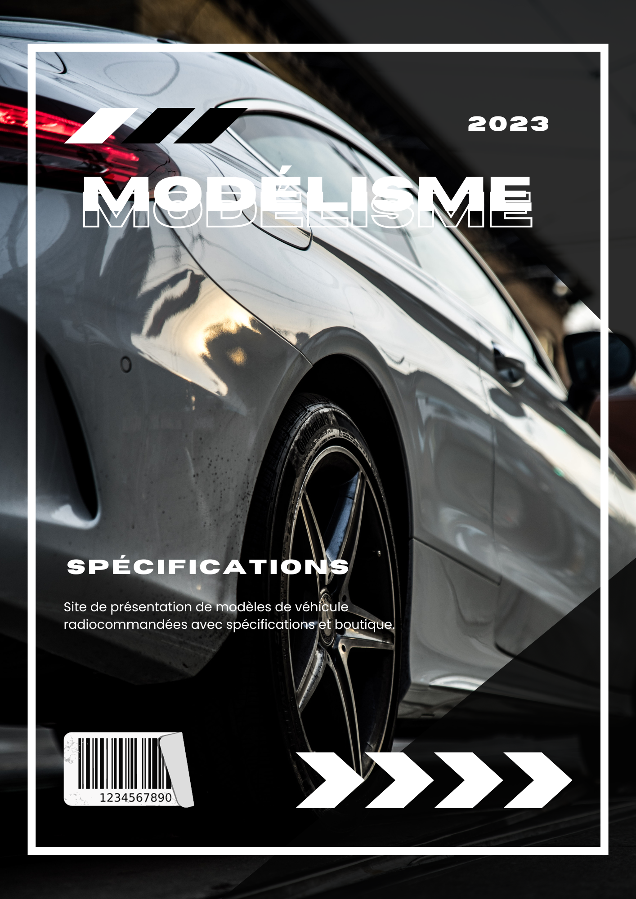

# Présentation de Voiture RC

]

Ce projet est une application web dédié à la la présentation de voitures radiocommandées (RC). Il permet aux utilisateurs de visualiser différentes voitures RC disponibles ainsi que leurs caractéristiques.

L'application utilise les technologies suivantes :
- HTML : pour la structure et le contenu de la page web.
- CSS : pour la mise en page et la présentation visuelle.
- JavaScript : pour la partie algorithmique et interactive de l'application.

## Fonctionnalités de l'application

1. Affichage des voitures RC : Les utilisateurs peuvent consulter la liste des voitures RC disponibles avec leurs détails tels que le modèle, la description ses caractéristiques ...

2. Boutique en ligne : Les utilisateurs peuvent acheter des voitures RC en utilisant PayPal (voir la section Configuration de PayPal pour plus de détails).

3. Compte utilisateur : Les utilisateurs peuvent créer un compte et se connecter.

## Configuration de PayPal

Il existe également une fonctionnalité de paiement en ligne qui permet aux utilisateurs d'acheter du matériel, des voitures RC en utilisant PayPal. Cependant il est actuellement desactivé pour empêcher les utilisateurs de faire des achats en ligne.

## Comment exécuter le projet

1. Clonez ou téléchargez le projet sur votre machine.

2. Ouvrez le fichier `index.html` dans un navigateur web.

3. Explorez les différentes fonctionnalités de l'application, consultez les voitures RC, accédez aux détails de chaque voiture et effectuez des achats en utilisant PayPal.

## Auteur

- KLS
